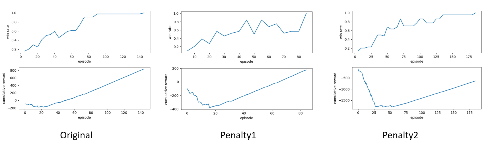

# Study of Penalty function on Maze Solvers


# Reinforcement Learning
Reinforcement Learning (RL) is a branch of machine learning where an agent learns to make decisions by performing actions in an environment to maximize cumulative rewards. It involves the following key components:

**Agent**: The learner or decision maker.

**Environment**: The external system with which the agent interacts.

**Actions**: Choices available to the agent that affect the environment.

**Rewards**: Feedback received by the agent based on the actions taken.

**Policy**: A strategy or set of rules used by the agent to determine actions based on the current state.

In RL, the agent explores and exploits its environment to find an optimal policy that maximizes the total reward over time. The learning process involves balancing exploration (trying new actions) and exploitation (choosing actions that yield higher rewards).

**In this study, we investigate the impact of various reward functions on maze-solving performance.**


# Actions and Rewards

| Action      | Description             |
|-------------|-------------------------|
| ←           | Move Left               |
| →           | Move Right              |
| ↑           | Move Up                 |
| ↓           | Move Down               |


| Reward Type             | Default Value | Remarks                                                         |
|-------------------------|---------------|-----------------------------------------------------------------|
| `reward_exit`           | 10            | Reward for reaching the exit cell                               |
| `penalty_move`          | -0.05         | Penalty for a move which did not result in finding the exit cell |
| `penalty_visited`       | -0.25         | Penalty for returning to a cell which was visited earlier        |
| `penalty_impossible_move` | -0.75      | Penalty for trying to enter an occupied cell or moving out of the maze |


# Reward Calculation

The reward for an agent in the environment is computed based on the following formula:

**Original Reward:**

Reward = reward_exit + penalty_move + *penalty_visited* + penalty_impossible_move

**Penalty1:**

Reward = reward_exit + penalty_move + *( penalty_visited * n )* + penalty_impossible_move

**Penalty2:**

Reward = reward_exit + penalty_move + *( penalty_visited * 2<sup>n</sup> )* + penalty_impossible_move

Where \( n \) is the number of times the agent has visited the current cell.


# Results


## Performance Comparison

### Setup 1
```
reward_exit = 10
min_reward = -1.5*size
```

| Reward Function | Algorithm | Episode | Time Taken (hh:mm:ss) |
|-----------------|-----------|---------|------------------------|
| Original         | Q Learning | 110     | 00:08:18               |
| Original         | SARSA      | 145     | 00:07:34               |
| Penalty1         | Q Learning | 120     | **00:05:28**               |
| Penalty1         | SARSA      | 85      | **00:04:34**               |
| Penalty2         | Q Learning | 135     | 00:06:21               |
| Penalty2         | SARSA      | 185     | 00:08:37               |

### Q-Learning


### SARSA


### Setup 2
```
reward_exit = 16
min_reward = -2.0*size
```


| Reward Function | Algorithm | Episode | Time Taken (hh:mm:ss) |
|-----------------|-----------|---------|------------------------|
| Original         | Q Learning | 90      | 00:05:52               |
| Original         | SARSA      | 115     | 00:07:07               |
| Penalty1         | Q Learning | 70      | **00:04:38**               |
| Penalty1         | SARSA      | 65      | **00:04:31**               |
| Penalty2         | Q Learning | 130     | 00:06:51               |
| Penalty2         | SARSA      | 155     | 00:06:45               |

### Q-Learning


### SARSA

# Credits
This work builds upon the ideas presented in [Reinforcement-Learning-Maze](https://github.com/erikdelange/Reinforcement-Learning-Maze.git). Special thanks to [Erik de Lange](https://github.com/erikdelange) for developing such a comprehensive work.
